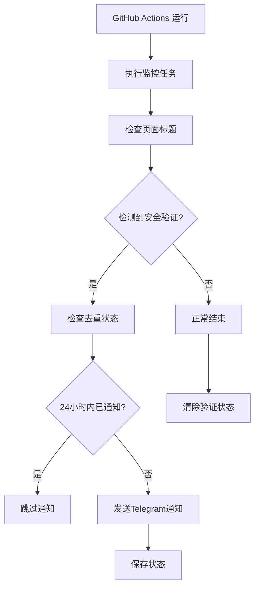

# 🔐 安全验证检测功能

## 功能概述

当小红书监控过程中遇到安全验证页面时，系统会自动检测并发送Telegram通知，提醒用户进行扫码认证。

## 🎯 核心特性

### ✅ 智能检测
- **多语言支持**：检测中英文安全验证关键词
- **多种模式**：支持各种验证页面类型
- **实时监控**：在每次workflow运行时自动检查

### 🔕 去重机制
- **避免重复通知**：相同的安全验证在24小时内只推送一次
- **状态持久化**：使用GitHub Actions缓存保存状态
- **智能清除**：检测到正常页面时自动清除验证状态

### 📱 详细通知
- **完整信息**：包含检测时间、工作流信息、处理步骤
- **用户友好**：提供清晰的解决方案指导

## 🔍 检测关键词

### 英文关键词
- `Security Verification`
- `Verification Required`
- `Please verify`
- `Captcha`
- `Robot Check`

### 中文关键词
- `安全验证`
- `扫码验证`
- `人机验证`
- `验证码`
- `需要验证`
- `账号异常`
- `登录验证`

## 📋 工作流程



## 🔧 技术实现

### 文件结构
```
scripts/
├── check-security-verification.sh  # 主检测脚本
└── test-deduplication.sh          # 去重功能测试

.github/workflows/
└── labubu.yml                     # GitHub Actions配置

状态文件:
└── security-verification-status.json  # 验证状态记录
```

### 状态文件格式
```json
{
    "last_verification_time": "2024-01-01 10:00:00",
    "last_pattern": "页面标题: Security Verification",
    "notification_sent": true
}
```

## 📱 通知示例

```
🔐 小红书安全验证提醒

检测到小红书需要安全验证！

🔍 检测到的内容: Security Verification
📱 请打开小红书APP进行扫码认证
🕐 检测时间: 2024-01-01 10:00:00 UTC
🤖 来源: GitHub Actions 自动监控
📋 工作流: Labubu Watcher
🔢 运行编号: 123

⚠️ 在完成验证之前，监控功能可能无法正常工作。

💡 处理步骤:
1. 打开小红书手机APP
2. 进入个人中心
3. 查看是否有验证提示
4. 完成扫码或其他验证步骤
5. 等待下次自动监控运行

🔄 注意: 相同的验证提醒在24小时内只会发送一次
```

## 🧪 测试

### 运行基础测试
```bash
./scripts/test-security-detection.sh
```

### 运行去重功能测试
```bash
./scripts/test-deduplication.sh
```

### 手动清除状态
如果需要重新发送通知，可以删除状态文件：
```bash
rm -f security-verification-status.json
```

## ⚙️ 配置

### 环境变量
- `BOT_TOKEN`: Telegram Bot Token
- `CHAT_ID`: Telegram Chat ID
- `GITHUB_WORKFLOW`: 工作流名称（自动设置）
- `GITHUB_RUN_NUMBER`: 运行编号（自动设置）

### GitHub Actions缓存
状态文件通过GitHub Actions缓存在不同运行之间持久化：
```yaml
- name: Cache security verification status
  uses: actions/cache@v4
  with:
    path: security-verification-status.json
    key: ${{ runner.os }}-security-status-${{ github.repository }}
```

## 🔄 去重逻辑

1. **首次检测**：发送通知并保存状态
2. **重复检测**：检查是否为相同验证类型
3. **不同验证**：发送新通知（不同类型的验证）
4. **正常页面**：清除验证状态
5. **24小时后**：重新发送通知（可选功能）

## 🚨 故障排除

### 通知未发送
1. 检查Telegram Bot Token和Chat ID
2. 验证网络连接
3. 查看GitHub Actions日志

### 重复通知
1. 检查状态文件是否正常保存
2. 验证缓存配置
3. 手动清除状态文件

### 检测失效
1. 确认关键词列表是否需要更新
2. 检查页面结构变化
3. 验证日志输出格式

## 📈 监控指标

- **检测准确率**：正确识别安全验证页面
- **去重效率**：避免重复通知的比例
- **响应时间**：从检测到通知的延迟
- **状态持久化**：缓存命中率
