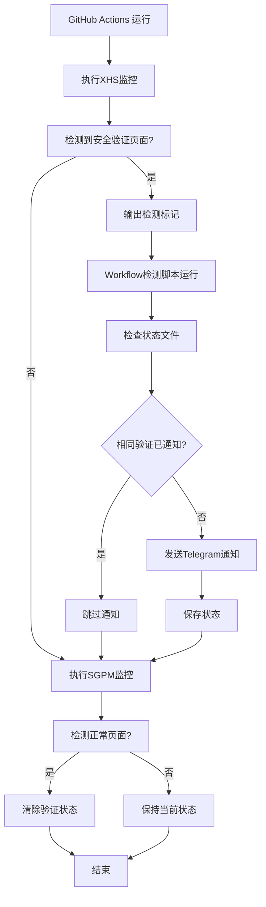

# 🔧 安全验证重复通知修复

## 问题描述

之前的实现存在以下问题：
1. **重复检测**：XhsScraper中会强制输出标准化的检测标记，导致重复触发
2. **去重逻辑不完善**：状态管理逻辑存在漏洞，无法有效防止重复通知
3. **状态清除时机不当**：在不合适的时候清除状态，导致重复通知

## 修复方案

### 🎯 核心原则
- **一次检测，一次通知**：每种类型的安全验证只在首次检测时发送通知
- **状态持久化**：直到用户手动解决验证问题，否则不重复通知
- **智能清除**：只有在确认验证已解决时才清除状态

### 🔧 具体修复

#### 1. XhsScraper检测优化
```typescript
// 修复前：强制输出标准化标记
this.logger.info('页面标题: Security Verification'); // 确保触发workflow检测

// 修复后：只在GitHub Actions环境中输出唯一标记
if (isGitHubActions) {
  this.logger.info('🔐 SECURITY_VERIFICATION_DETECTED 🔐');
}
```

#### 2. 去重逻辑改进
```bash
# 修复前：复杂的时间检查逻辑
if [ "$last_pattern" != "$current_pattern" ] || [ "$notification_sent" != "true" ]; then
    return 0  # 应该发送
else
    # 检查24小时时间差...
fi

# 修复后：简化的状态检查
if [ "$notification_sent" = "true" ] && [ "$last_pattern" = "$current_pattern" ]; then
    return 1  # 不应该发送（相同验证已通知）
fi
return 0  # 应该发送
```

#### 3. 状态清除优化
```bash
# 修复前：总是清除状态
save_status "" "" "false"

# 修复后：只有在确实发送过通知时才清除
if [ "$notification_sent" = "true" ]; then
    save_status "" "" "false"
    echo "🧹 已清除安全验证状态（验证已解决）"
else
    echo "📝 保持当前状态（之前的通知未成功发送）"
fi
```

## 🧪 测试验证

### 测试场景
1. **首次检测**：✅ 发送通知并保存状态
2. **重复检测**：✅ 跳过通知（去重生效）
3. **不同验证**：✅ 发送新通知（不同类型）
4. **正常页面**：✅ 清除状态（验证已解决）
5. **状态清除后**：✅ 重新发送通知（新的验证周期）

### 测试结果
```
=== 测试场景1: 首次检测到安全验证 ===
✅ 安全验证通知发送成功

=== 测试场景2: 再次检测到相同安全验证（应该跳过） ===
🔕 检测到安全验证，但相同通知已在24小时内发送过，跳过推送

=== 测试场景3: 检测到不同的安全验证 ===
✅ 安全验证通知发送成功

=== 测试场景4: 正常页面（应该清除状态） ===
🧹 已清除安全验证状态（验证已解决）

=== 测试场景5: 再次检测到安全验证（状态已清除，应该发送） ===
✅ 安全验证通知发送成功
```

## 📋 工作流程（修复后）



## 🎯 修复效果

### ✅ 解决的问题
1. **消除重复通知**：相同的安全验证只会通知一次
2. **保持及时性**：首次检测到验证时立即通知
3. **智能状态管理**：只有在验证真正解决后才清除状态
4. **支持多种验证**：不同类型的验证会分别处理

### 📊 预期行为
- **首次安全验证**：立即发送Telegram通知
- **持续安全验证**：不再重复发送通知
- **验证解决后**：自动清除状态，准备下次检测
- **新的验证类型**：发送新的通知

### 🔄 用户体验
1. **收到通知**：表示检测到安全验证，需要手动处理
2. **不再收到重复通知**：避免通知轰炸
3. **验证解决后**：系统自动恢复正常监控
4. **新问题出现**：会重新发送通知

## 🚀 部署说明

修复已包含在以下文件中：
- `src/scrapers/XhsScraper.ts`：优化检测逻辑
- `scripts/check-security-verification.sh`：改进去重和状态管理
- `.github/workflows/labubu.yml`：增强workflow日志
- `scripts/test-security-fix.sh`：验证修复效果

所有修改都向后兼容，不会影响现有功能。
